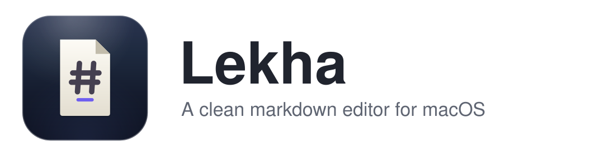

<p align="center">
  <picture>
    <source media="(prefers-color-scheme: dark)" srcset="assets/banner/banner-dark.svg">
    
  </picture>
</p>

<p align="center">
  <a href="https://mocarram.github.io/Lekha/"><strong>Website</strong></a>
  &nbsp;·&nbsp;
  <a href="https://github.com/mocarram/Lekha/releases/latest">Download</a>
</p>

# Lekha

## Install / Download

**Download the latest `.dmg`** from the [Releases page](https://github.com/mocarram/Lekha/releases/latest):

- Apple Silicon: `Lekha-<version>-arm64.dmg`
- Intel: `Lekha-<version>-x64.dmg`

**Or via Homebrew:**

    brew tap mocarram/tap
    brew install --cask lekha

> Builds are currently unsigned during early releases - on first launch macOS may
> say the app "cannot be opened". Right-click the app, choose **Open** (or run
> `xattr -dr com.apple.quarantine /Applications/Lekha.app`). Signed + notarized
> builds (no warning) land once code-signing is enabled.

## Development

```bash
npm install
npm run dev
```

## Build

```bash
npm run build
npm run dist:mac
```

See [`docs/publishing/releasing.md`](docs/publishing/releasing.md) for the full
release process and [`docs/publishing/homebrew.md`](docs/publishing/homebrew.md)
for Homebrew distribution.
