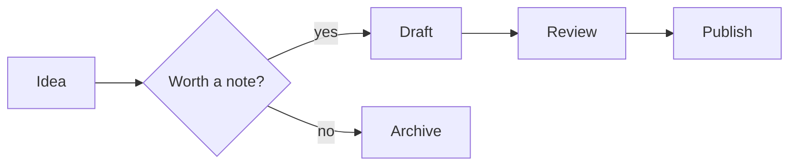
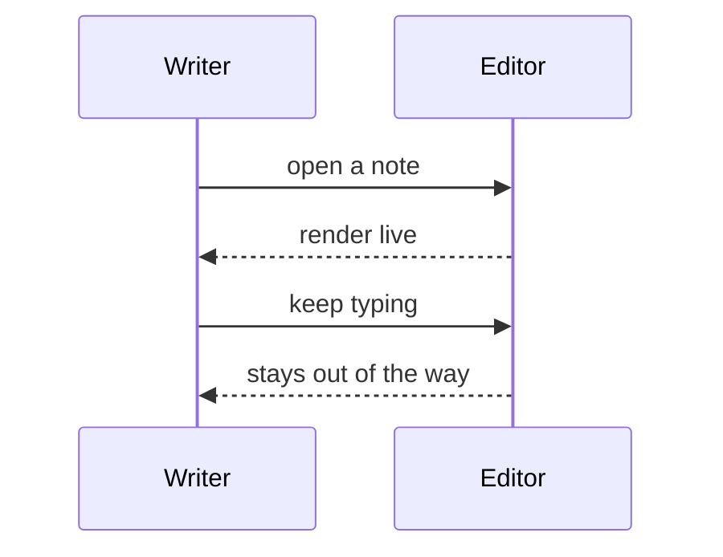

# Math & diagrams

Formulas and diagrams render live, right alongside your writing - no export
step, no external preview.

## Inline and block math

The area of a circle is $A = \pi r^2$, and the Gaussian integral is a classic:

$$
\int_{-\infty}^{\infty} e^{-x^2}\,dx = \sqrt{\pi}
$$

Euler's identity ties five constants together in a single line:

$$
e^{i\pi} + 1 = 0
$$

## Flowcharts

## Sequences

Diagrams follow the active theme, so they look right in light or dark.
