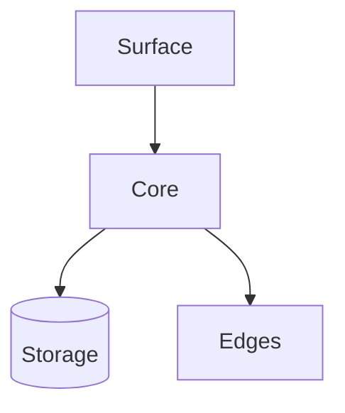

# Architecture

Notes on how the pieces fit together.

## Layers

- **Surface** - what the reader sees and touches
- **Core** - the rules that never change
- **Edges** - where the system meets the outside world

> Keep the core small. Push decisions to the edges, where they are cheap to
> change.

## A working diagram

The goal is a shape you can hold in your head all at once.
